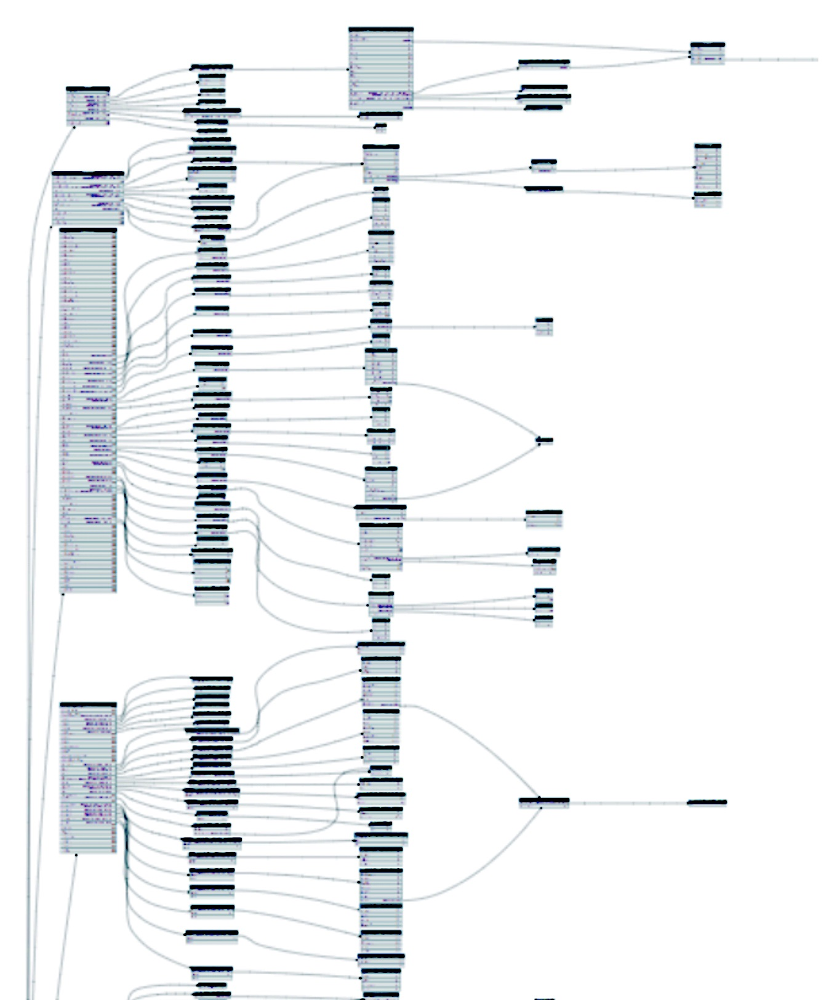

Clients are now actively using a component approach. And if you look at Facebook Relay and how they use the composition of components and GraphQL fragments, you will notice how they broke the paradigm of writing a query "at the top" and offered a more convenient and error-resistant solution:

- each component has its own GraphQL fragment (it can have several fragments)
- GraphQL fragment contains only those fields that are necessary for the current component
- to form a GraphQL query, they compose components and fragments

It turns out that the final GraphQL query is written from the bottom up – depending on what components are used on the page, the necessary GraphQL fragments will be taken. If someone at the bottom decides to extend his component with additional data, he will simply expand the list of fields in the GraphQL fragment of this component. And, accordingly, automatically all GraphQL queries that use this fragment, will start to retrieve the additional fields. Т.е. the query begins to form at the bottom, where the data will be used, and large fragments are already glued up. At the end of May 2019 I will speak in St. Petersburg and Moscow, where I will reveal this topic in more detail. Here I will for sure add a link to the video.

For GraphQL fragments working fine on the client, you need a server that will indicate in the scheme as many relationships as possible between its types. Justifying the word Graph in GraphQL. Otherwise, if the schema contains few links and does not look like a tree, it can effectively be called RestQL.

**"Hairy GraphQL" is a GraphQL schema that contains many relationships between types.**

As an example, we can cite a strongly connected, "hairy" GitHub API scheme (see how many connections between types):

And as an example of a loosely-connected, "bald" `RestQL` API this tree looking API will work perfectly:

These pictures are made using the graphql-voyager tool by Ivan Goncharov and Roman Gotsiy. You can download the introspection of any scheme and visually evaluate whether she "hairy" or "bald".

Т.е. the more connections in your scheme, the easier is to the clients to make requests using GraphQL fragments. Unfortunately, on the "bald" scheme to apply a fragmented approach normally will not work. In a loosely connected graph, it is more difficult to get one vertex from another vertex. Therefore, clients will have to write new queries through the root to get the necessary data. Instead of quering its data graph a bit deeper. In other words, say hi to the stone age of early 2000s with its REST API.
